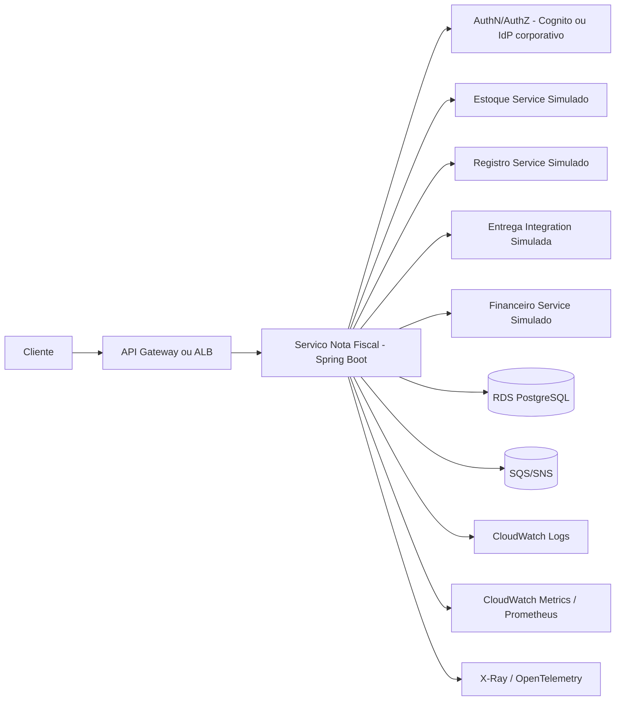

# Gerador de Nota Fiscal

Aplicacao Spring Boot para processamento de pedidos e emissao de notas fiscais com foco em:

- corretude de calculo (subtotal, tributo por item, frete)
- isolamento por requisicao (sem estado compartilhado)
- idempotencia por payload
- resiliencia no tratamento de erros de entrada e integracao
- observabilidade e qualidade de entrega (CI + cobertura)

## Estado atual da entrega do desafio

- bugs funcionais corrigidos (acumulo entre execucoes e inconsistencias de totais)
- refatoracao arquitetural com `Strategy`, `Resolver`, `Facade` e servicos especializados
- Java 21 + Spring Boot 3.3.6
- testes de regressao e validacao de contrato ampliados
- pipeline CI com `clean verify`
- gate de cobertura JaCoCo em 80%

## Tecnologias

- Java 21
- Spring Boot 3.3.6
- Spring Web
- Bean Validation (`jakarta.validation`)
- Spring Actuator
- Maven Wrapper
- JUnit 5 + Mockito
- JaCoCo
- GitHub Actions

## Arquitetura e funcionamento

### Fluxo principal

`GeradorNFController` -> `GeradorNotaFiscalServiceImpl` -> `NotaFiscalIntegracaoFacade`

Etapas de processamento:

1. valida payload e regras obrigatorias
2. gera chave de idempotencia do payload (`PedidoIdempotencyKeyGenerator`)
3. aplica idempotencia em memoria (`InMemoryNotaFiscalIdempotencyStore`)
4. calcula subtotal real pelos itens e valida consistencia com `valor_total_itens` informado
5. resolve aliquota por tipo de pessoa/regime (`TributacaoAliquotaResolver` + `Strategy`)
6. calcula tributo por item (`CalculadoraAliquotaProduto`)
7. calcula frete ajustado por regiao (`FreteCalculator`)
8. monta `NotaFiscal`
9. executa integracoes simuladas em paralelo (`NotaFiscalIntegracaoFacade`)

### Separacao de responsabilidades

- `web/controller`: entrada HTTP
- `web/error`: contrato de erro e mapeamento de excecoes
- `service/impl`: orquestracao de caso de uso e integracoes
- `service/tax`: regras de tributacao por estrategia
- `service/idempotency`: deduplicacao por payload
- `service`: calculos de frete e tributo por item
- `port/out`: simulacao de integracao externa de entrega

## Regras de negocio

### Regras de calculo

- subtotal da nota = soma de (`valor_unitario * quantidade`) de cada item
- tributo do item = (`valor_unitario * quantidade`) * aliquota
- arredondamento monetario interno: `BigDecimal`, `scale=2`, `RoundingMode.HALF_UP`
- frete ajustado por regiao:
  - `NORTE`: x 1.08
  - `NORDESTE`: x 1.085
  - `CENTRO_OESTE`: x 1.07
  - `SUDESTE`: x 1.048
  - `SUL`: x 1.06

### Regras de aliquota

`Pessoa Fisica` (`tipo_pessoa=FISICA`):

- subtotal < 500 -> 0%
- 500 <= subtotal <= 2000 -> 12%
- 2000 < subtotal <= 3500 -> 15%
- subtotal > 3500 -> 17%

`Pessoa Juridica` (`tipo_pessoa=JURIDICA`) por regime:

- `SIMPLES_NACIONAL`: 3%, 7%, 13%, 19% (faixas 1000/2000/5000)
- `LUCRO_REAL`: 3%, 9%, 15%, 20% (faixas 1000/2000/5000)
- `LUCRO_PRESUMIDO`: 3%, 9%, 16%, 20% (faixas 1000/2000/5000)
- sem estrategia compativel -> 0%

### Regras de endereco de entrega

O destinatario deve possuir endereco de entrega com:

- `finalidade` obrigatoria (`ENTREGA` ou `COBRANCA_ENTREGA` elegivel para frete)
- `regiao` obrigatoria para calculo de frete

## Contrato da API

### Endpoint

- `POST /api/pedido/gerarNotaFiscal`

### Tipos principais (entrada)

- `tipo_pessoa`: `FISICA` | `JURIDICA`
- `regime_tributacao`: `SIMPLES_NACIONAL` | `LUCRO_REAL` | `LUCRO_PRESUMIDO` | `OUTROS`
- `tipo` (documento): `CPF` | `CNPJ`
- `finalidade`: `COBRANCA_ENTREGA` | `ENTREGA` | `COBRANCA` | `OUTROS`
- `regiao`: `NORTE` | `NORDESTE` | `CENTRO_OESTE` | `SUDESTE` | `SUL`

### Payloads de referencia (imutaveis)

- `src/main/resources/paylods/teste-pf.json`
- `src/main/resources/paylods/teste-pj-simples.json`

Exemplo de request (PF):

```json
{
  "id_pedido": 1,
  "data": "2022-05-01",
  "valor_total_itens": 100.0,
  "valor_frete": 10.0,
  "itens": [
    {
      "id_item": 1,
      "descricao": "Teclado USB",
      "valor_unitario": 50,
      "quantidade": 2
    }
  ],
  "destinatario": {
    "nome": "John Doe",
    "tipo_pessoa": "FISICA",
    "documentos": [
      {
        "tipo": "CPF",
        "numero": "88740347095"
      }
    ],
    "enderecos": [
      {
        "logradouro": "Av do estado",
        "numero": "5533",
        "complemento": "4 anndar b",
        "bairro": "Mooca",
        "cidade": "Sao Paulo",
        "estado": "SP",
        "pais": "Brasil",
        "cep": "03105003",
        "finalidade": "ENTREGA",
        "regiao": "SUDESTE"
      }
    ]
  }
}
```

### Response de sucesso (200)

```json
{
  "id_nota_fiscal": "uuid",
  "data": "2026-03-30T10:00:00",
  "valor_total_itens": 100.0,
  "valor_frete": 10.48,
  "itens": [
    {
      "id_item": "1",
      "descricao": "Teclado USB",
      "valor_unitario": 50.0,
      "quantidade": 2,
      "valor_tributo_item": 12.0
    }
  ],
  "destinatario": {
    "nome": "John Doe",
    "tipo_pessoa": "FISICA"
  }
}
```

### Responses de erro

Formato padrao (`ApiErrorResponse`):

```json
{
  "timestamp": "2026-03-30T10:00:00",
  "status": 400,
  "error": "Bad Request",
  "message": "Payload JSON invalido",
  "details": [
    "Campo 'id_pedido' recebeu valor invalido 'abc'. Esperado: Long."
  ]
}
```

Mapeamentos:

- `400 Bad Request`
  - validacao bean (`MethodArgumentNotValidException`)
  - erro de desserializacao (`HttpMessageNotReadableException`)
  - regra de negocio (`BadRequestException`)
- `502 Bad Gateway`
  - falha em integracao externa simulada (`IntegracaoNotaFiscalException`)
- `500 Internal Server Error`
  - erro inesperado

Observacao importante de contrato:

- `spring.jackson.deserialization.fail-on-unknown-properties=true`
- campos extras no JSON sao rejeitados com `400`

## Idempotencia e confiabilidade

- chave idempotente gerada por hash SHA-256 do payload canonico
- chamadas iguais concorrentes reaproveitam a mesma execucao
- status internos:
  - `IN_PROGRESS`
  - `COMPLETED`
  - `FAILED`
- TTL configuravel em `application.properties`:
  - `idempotencia.nota-fiscal.ttl-completed-seconds=600`
  - `idempotencia.nota-fiscal.ttl-failed-seconds=30`
  - `idempotencia.nota-fiscal.cleanup-interval-millis=30000`

## Performance e latencia simulada

- o bug de degradacao progressiva foi corrigido removendo estado compartilhado
- integracoes agora sao orquestradas em paralelo (`ExecutorService` com pool fixo 4)
- latencias simuladas foram preservadas (restricao do desafio)
- para entrega, o `sleep` adicional para lotes grandes continua ativo no integrador

## Qualidade, testes e cobertura

Estrategia de testes:

- unitarios de regra de negocio e aliquota
- testes de servico para regressao funcional e idempotencia concorrente
- testes de controller para contrato HTTP/validacao

Exemplos de cenarios cobertos:

- acumulacao entre execucoes consecutivas
- rejeicao com `400` quando `valor_total_itens` diverge do subtotal calculado
- validacao detalhada de tipos, data invalida e campo desconhecido
- validacao de `destinatario.enderecos[].finalidade` e `destinatario.enderecos[].regiao`
- resposta `502` em falha de integracao

Cobertura:

- JaCoCo com gate minimo de 80% no `verify`
- cobertura atual medida no projeto: 87.63% de linhas
- relatorio: `target/site/jacoco/index.html`

## Observabilidade

Configuracao atual:

- logs em nivel `INFO` para aplicacao
- logs de validacao e erro no `ApiExceptionHandler`
- Actuator exposto em:
  - `/actuator/health`
  - `/actuator/info`
  - `/actuator/metrics`
  - `/actuator/prometheus`

## Como executar localmente

### Pre-requisitos

- Java 21
- Maven Wrapper (ja incluso)

## CI/CD

Workflow versionado: `.github/workflows/ci.yml`

- trigger: `push` e `pull_request` na branch `develop` e `main`
- pipeline: checkout -> Java 21 -> cache Maven -> `./mvnw -B clean verify`
- falha se testes ou gate de cobertura (80%) falharem

## O que foi corrigido em relacao ao baseline do desafio

- removido vazamento de estado entre execucoes
- totals e tributos alinhados ao calculo real dos itens
- idempotencia por payload com controle de concorrencia
- tratamento de erro HTTP detalhado para facilitar correcao por quem integra
- validacoes de contrato fortalecidas sem quebrar payload de entrada
- arquitetura modularizada para facilitar manutencao e evolucao

## Arquitetura de referencia (Mermaid)



## Trade-offs e proximos passos

- contrato de resposta foi mantido compativel; nao ha campo explicito de total final consolidado
- valores monetarios de contrato seguem `double`, com calculo interno em `BigDecimal`
- store de idempotencia atual e in-memory

Proximos passos recomendados:

1. persistir nota fiscal e idempotencia em storage duravel
2. implementar retries com backoff para integracoes externas
3. adicionar correlation-id por request em todos os logs
4. enriquecer resposta com subtotal/tributos/total final sem quebrar compatibilidade

