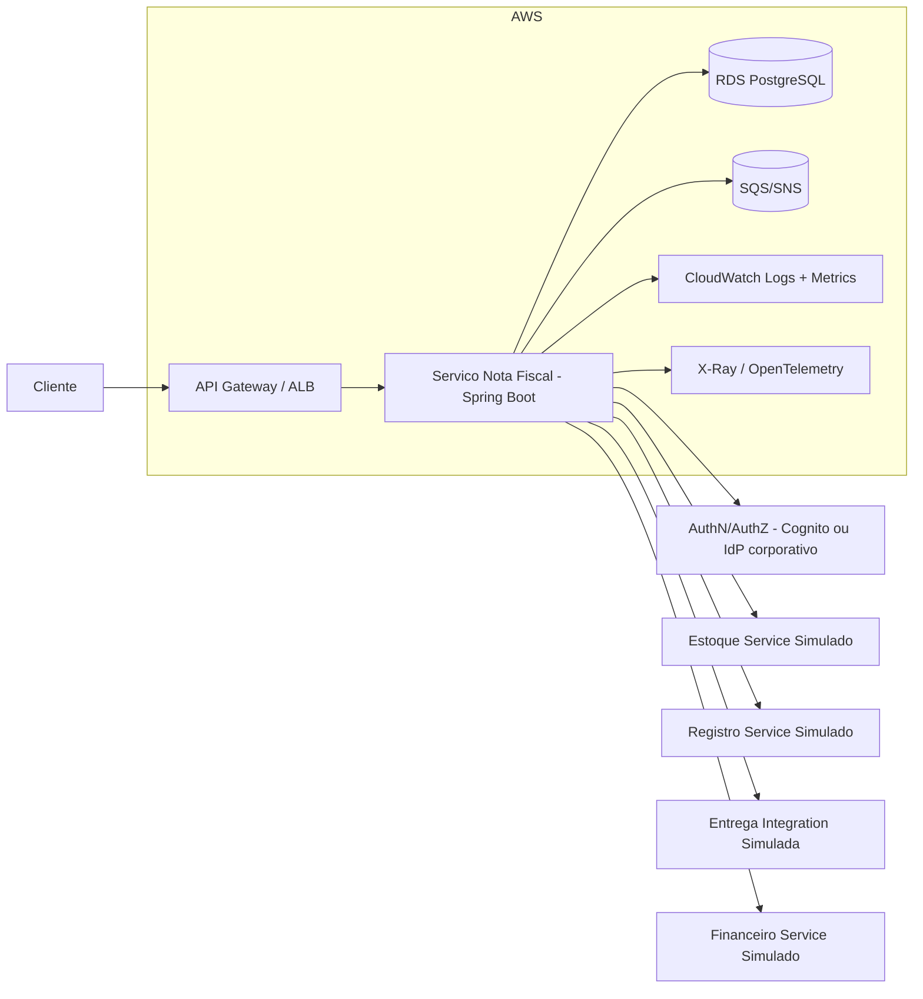

# Gerador de Nota Fiscal

Aplicacao Spring Boot para processamento de pedidos e geracao de notas fiscais com calculo de tributos, frete e integracoes externas simuladas.

## Stack

- Java 21
- Spring Boot 3.3.6
- Maven Wrapper (`mvnw` / `mvnw.cmd`)
- JUnit 5 + Mockito

## Como executar

### 1) Configurar Java 21

No Windows (PowerShell):

```powershell
$env:JAVA_HOME="C:\Program Files\Java\jdk-21"
$env:Path="$env:JAVA_HOME\bin;$env:Path"
java -version
```

### 2) Rodar aplicacao

```powershell
.\mvnw.cmd spring-boot:run
```

Endpoint principal:

- `POST /api/pedido/gerarNotaFiscal` (retorna `NotaFiscal` em JSON)

Erros relevantes:

- `400 Bad Request`: payload invalido ou regra de negocio nao atendida
- `502 Bad Gateway`: falha em integracoes simuladas

Exemplo de payloads (mantidos compativeis):

- `src/main/resources/paylods/teste-pf.json`
- `src/main/resources/paylods/teste-pj-simples.json`

## Como executar testes

```powershell
$env:JAVA_HOME="C:\Program Files\Java\jdk-21"
$env:Path="$env:JAVA_HOME\bin;$env:Path"
.\mvnw.cmd test
```

## Diagnostico e correcoes aplicadas

### Fluxo principal

`GeradorNFController` -> `GeradorNotaFiscalServiceImpl` ->
1. valida entrada e regras de negocio
2. resolve aliquota tributaria por estrategia
3. calcula itens da nota com tributo por item
4. calcula frete por regiao
5. monta `NotaFiscal`
6. aciona integracoes simuladas (estoque, registro, entrega, financeiro)

### Classe central (God class) identificada

`GeradorNotaFiscalServiceImpl` concentrava:

- regra tributaria de PF/PJ e faixas
- regra de frete
- orquestracao de integracoes
- criacao de servicos com `new`

Isso foi separado para reduzir acoplamento e melhorar manutenibilidade.

### Bug de acumulacao entre execucoes (corrigido)

Causa raiz:

- `CalculadoraAliquotaProduto` usava `static List<ItemNotaFiscal>`, acumulando estado global entre chamadas.

Correcao:

- lista agora e local por requisicao.
- processamento passa a ser idempotente por entrada.

Teste de regressao:

- `src/test/java/br/com/itau/calculadoratributos/GeradorNotaFiscalServiceImplTest.java`
  - `shouldNotAccumulateItemsBetweenConsecutiveExecutions`

### Inconsistencias de totais/tributos (corrigido)

Problemas corrigidos:

- total da nota dependia de `pedido.valorTotalItens` mesmo quando divergente dos itens.
- tributo por item nao considerava `quantidade`.
- ausencia de padrao consistente de arredondamento.

Correcao:

- subtotal calculado por `valor_unitario * quantidade`.
- tributo por item calculado sobre o total do item.
- uso de `BigDecimal` + `RoundingMode.HALF_UP` com scale 2 nos valores monetarios internos.

Teste de regressao:

- `shouldCalculateConsistentTotalsAndTaxesIgnoringInconsistentPedidoTotal`

### Performance e latencia simulada (sem remover sleep)

Problemas observados:

- crescimento de latencia ao longo das execucoes por vazamento de estado (lista estatica).
- penalidade excessiva fixa para pedidos maiores no integrador de entrega.
- integracoes executadas de forma sequencial.

Melhorias:

- removido estado compartilhado (elimina degradacao acumulada).
- mantida simulacao de latencia com `sleep`, reduzindo penalidade de 5000ms para 700ms para lotes >5 itens.
- integracoes executadas em paralelo controlado via `ExecutorService` (pool fixo com 4 threads).
- falhas de integracao agregadas no facade com erro explicito (`IntegracaoNotaFiscalException`).

Testes de regressao:

- `shouldApplyAdditionalLatencyOnlyForRealLargeItemSets`
- `shouldReturnBadGatewayWhenIntegrationFails`

## Refatoracao de arquitetura

Novos componentes principais:

- `TributacaoAliquotaStrategy` + estrategias por regime (`PessoaFisicaAliquotaStrategy`, `SimplesNacionalAliquotaStrategy`, etc.)
- `TributacaoAliquotaResolver` para selecionar a estrategia correta
- `FreteCalculator` para regra de frete por regiao
- `NotaFiscalIntegracaoFacade` para orquestrar integracoes externas em paralelo e consolidar falhas

Beneficios:

- melhor separacao de responsabilidades (dominio, calculo, integracao, orquestracao)
- base extensivel para novas regras tributarias sem alterar o fluxo principal
- menor complexidade ciclomatica na classe de servico principal

## Build/deploy e operacao (proposta)

### CI/CD

1. Pull Request -> `mvn test` + analise estatica
2. Merge main -> build de imagem com Spring Boot plugin / Docker
3. Deploy automatizado por ambiente (dev/hml/prod)
4. Smoke test de endpoint apos deploy

### Observabilidade

- Logs estruturados com correlation-id por requisicao
- Endpoints operacionais com Actuator:
  - `/actuator/health`
  - `/actuator/info`
  - `/actuator/metrics`
  - `/actuator/prometheus`
- Metricas: tempo por etapa, taxa de erro, throughput
- Tracing distribuido (OpenTelemetry)
- Dashboards + alertas (CloudWatch/Grafana)

## Arquitetura (Mermaid)



## Trade-offs e proximos passos

- Mantivemos os DTOs e contratos de entrada sem mudancas para compatibilidade.
- Campos monetarios permanecem em `double` no contrato atual; internamente o calculo usa `BigDecimal`.
- Proximos passos recomendados:
  1. adicionar persistencia da nota fiscal e idempotency key por requisicao
  2. adicionar retry com backoff para integracoes simuladas
  3. padronizar resposta com subtotal/tributos/total final explicitos sem quebrar compatibilidade

